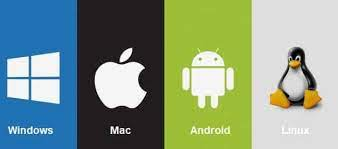

# INNOVACCIÓN - Semana 1

Conceptos de la clase.

## Tarjeta madre

La tarjeta madre también conocida como placa madre, placa base o motherboard (en inglés), es la tarjeta principal en la estructura interna del computador donde se encuentran los circuitos electrónicos, el procesador, las memorias, y las conexiones principales, en ella se conectan todos los componentes del computador.

Esta tarjeta tiene como función principal controlar todos los elementos del servidor, de ella depende que dichos componentes estén bien comunicados unos de otros para garantizar el funcionamiento del sistema, es por eso que es un dispositivo muy importante dentro del computador.

  

## Procesador

El procesador es el cerebro del sistema, justamente procesa todo lo que ocurre en la PC y ejecuta todas las acciones que existen. Cuanto más rápido sea el procesador que tiene una computadora, más rápidamente se ejecutarán las órdenes que se le den a la máquina. Este componente es parte del hardware de muchos dispositivos, no solo de tu computadora.

El procesador es una pastilla de silicio que va colocada en el socket sobre la placa madre dentro del gabinete de la computadora de escritorio, la diferencia en una portátil es que está directamente soldado.

  

## Memoria ROM

La memoria ROM es el medio de almacenamiento de programas o datos que permiten el buen funcionamiento de los ordenadores o dispositivos electrónicos a través de la lectura de la información sin que pueda ser destruida o reprogramable. El significado de memoria ROM es “Read Only Memory” traducido al español “Memoria de solo lectura.”

La memoria ROM es conocida como memoria no volátil ya que la información contenida en ella no es borrable al apagar el dispositivo electrónico.

La memoria ROM se encuentra instalada en la tarjeta madre “motherboard” lugar donde se encuentra la información básica del equipo, llamada “BIOS.”

  

## Memoria RAM

La memoria RAM o Random Access Memory (memoria de acceso aleatorio) es un componente que forma parte del ecosistema de hardware, pasado y presente (quizás futuro), y que tiene como mayor finalidad crear un puente entre el sistema operativo, software, procesador y otros dispositivos para que estos intercambien información entre ellos.

Básicamente es la memoria principal del sistema y como tal dispone de una gran velocidad de lectura y escritura, ya que se comunica con casi todas las partes de un PC actual, pero al mismo tiempo sigue estando por detrás en importancia de la memoria caché de la CPU y en parte en consonancia con otro tipo de memoria como la ROM.

  

## Trajeta grafica

La tarjeta gráfica o tarjeta de vídeo de un componente que viene integrado en la placa base del PC o se instala a parte para ampliar sus capacidades. Concretamente, esta tarjeta está dedicada al procesamiento de datos relacionados con el vídeo y las imágenes que se están reproduciendo en la computadora.

Hay dos tipos de tarjetas gráficas, las integradas que van acopladas al propio procesador como una parte de este, y las dedicadas que puedes conectar a parte en el ordenador como si fueran una unidad externa en la que la CPU puede apoyarse para tareas especialmente exigentes. En ambos casos, la gráfica conectará directamente con el monitor para enviarle los datos.

  

## Arquitectura de procesadores

La arquitectura de un procesador se refiere generalmente a su estructura, es decir, al diseño que a utilizado el fabricante para dar forma al mismo.

Actualmente Intel utiliza un diseño de núcleo monolítico, lo que significa que todos los núcleos están integrados en un único bloque de silicio, mientras que AMD utiliza un diseño que podemos calificar como MCM (módulo multi-chip), en el que los núcleos del procesador se integran en dos o más bloques de silicio, que se comunican entre sí a través del sistema Infinity Fabric.

Cada una tiene sus ventajas y sus desventajas. En el caso de la arquitectura de núcleo monolítico permite conseguir un mayor rendimiento y unas mayores frecuencias de trabajo, pero es más costosa y complicada de desarrollar, sobre todo cuando se aplican reducciones de proceso. Por contra, la arquitectura MCM es más económica y más sencilla de producir, y también asimila mejor los saltos de proceso, pero tiene a ofrecer un rendimiento inferior.

  

## Sistema Operativo

Un sistema operativo es un conjunto de programas que mediante órdenes electrónicas, controlan la actividad total del computador.

Ofrecen la posibilidad de administrar de manera más eficiente los recursos con los que cuenta una computadora, éste también es conocido bajo el nombre de software de sistema. Por medio de éste, el resto de los software dentro de una computadora puedan funcionar con normalidad, ya que permite el reconocimiento de alguna conexiones, crea controles, ofrece seguridad, envíos, entre otros. Los programas de software más utilizados en la actualidad son el sistema operativo Windows, sistema operativo Linux, OS/2 y DOS.

  

## Kernel

El núcleo o kernel es la parte central de un sistema operativo y es el que se encarga de realizar toda la comunicación segura entre el software y el hardware del ordenador. El núcleo kernel es la parte más importante del sistema operativo Unix y sus derivados, como Linux y todas las distribuciones que dependen de él.

Aunque Windows también posee su propio kernel, hay una diferencia fundamental entre este y el de Linux. Mientras que el núcleo de Windows es completamente hermético y nadie puede modificarlo, el de Linux es de código abierto, por lo que cualquiera puede hacerles las modificaciones que quiera, esto permite que existan distintas distribuciones de Linux.

## Modelo OSI

El modelo OSI lo desarrolló allá por 1984 la organización ISO (International Organization for Standarization). Este estándar perseguía el ambicioso objetivo de conseguir interconectar sistema de procedencia distinta para que esto pudieran intercambiar información sin ningún tipo de impedimentos debido a los protocolos con los que estos operaban de forma propia según su fabricante.

El modelo OSI está conformado por 7 capas o niveles de abstracción. Cada uno de estos niveles tendrá sus propias funciones para que en conjunto sean capaces de poder alcanzar su objetivo final. Precisamente esta separación en niveles hace posible la intercomunicación de protocolos distintos al concentrar funciones específicas en cada nivel de operación.

  

## Nube

La nube es el nombre que le damos al servicio de almacenamiento de datos a servidores localizados en la red. Esta modalidad permite subir, abrir, modificar o usar programas y archivos a través de una conexión sin la necesidad de que se encuentren en el almacenamiento del dispositivo que usas.

  

## IaaS

La infraestructura como servicio (IaaS), también conocida como servicios de infraestructura en la nube, es una forma de *cloud computing* que ofrece a los usuarios finales una infraestructura de TI a través de Internet. Por lo general, se la asocia con la informática sin servidor.

  

## PaaS

La Plataforma como servicio (PaaS) es una modalidad del cloud computing en la cual un tercero brinda el sistema de hardware y una plataforma de software de aplicaciones. La PaaS es ideal principalmente para los desarrolladores y los programadores, ya que permite que el usuario desarrolle, ejecute y gestione sus propias aplicaciones sin tener que diseñar ni mantener la infraestructura ni la plataforma que suelen estar relacionadas con el proceso.

## SaaS

El software como servicio (SaaS) es una forma de cloud computing que ofrece a los usuarios una aplicación en la nube junto con toda su infraestructura de TI y plataformas subyacentes. Puede ser la solución ideal para las empresas, ya sean grandes o pequeñas, o las personas con las siguientes características:

* No quieren encargarse de las tareas de mantenimiento de la infraestructura, las plataformas y el software.
* Tienen desafíos que pueden resolverse con una personalización mínima.
* Prefieren los modelos de suscripción de software.

La implementación de SaaS permite reducir los costos iniciales de los usuarios. Esto se debe a que ya no es necesario adquirir sistemas de software todo el tiempo ni invertir en una infraestructura de TI sólida y on-premise, como sí ocurre con el software tradicional. Sin embargo, se recomienda que los usuarios inviertan en sistemas de hardware de red rápidos, ya que la velocidad de conexión a Internet determina el rendimiento del servicio.

## Frontend

Front End es la parte de una aplicación que interactúa con los usuarios, es conocida como el lado del cliente. Básicamente es todo lo que vemos en la pantalla cuando accedemos a un sitio web o aplicación: tipos de letra, colores, adaptación para distintas pantallas(RWD), los efectos del ratón, teclado, movimientos, desplazamientos, efectos visuales… y otros elementos que permiten navegar dentro de una página web. Este conjunto crea la experiencia del usuario.

Un desarrollador front end debe conocer los siguientes lenguajes de programación: **HTML5, CSS3, JavaScript, Jquery, Ajax.

  

## Backend

Cuando hablamos de “Back end” nos referimos al interior de las aplicaciones que viven en el servidor y al que a menudo se le denomina “el lado del servidor”.

El back end del sitio web consiste en un servidor, una aplicación y una base de datos. Se toman los datos, se procesa la información y se envía al usuario.  Los desarrolladores de Front end y Back end suelen trabajar juntos para que todo funcione correctamente.

Un desarrollador Back end debe tener amplios conocimientos de los siguientes lenguajes: frameworks y los tipos de base de datos. No siendo necesario conocer todos los lenguajes pero sí entender y saber trabajar con algunos de ellos: **ASP.NET , PHP, Python, Ruby, Node.js, Java, MySQL, SQL Server, PostgreSQL, Oracle, MongoDB.

  

## API

Una API es un conjunto de definiciones y protocolos que se utiliza para desarrollar e integrar el software de las aplicaciones. API significa interfaz de programación de aplicaciones.

Las API permiten que sus productos y servicios se comuniquen con otros, sin necesidad de saber cómo están implementados. Esto simplifica el desarrollo de las aplicaciones y permite ahorrar tiempo y dinero. Las API le otorgan flexibilidad; simplifican el diseño, la administración y el uso de las aplicaciones, y proporcionan oportunidades de innovación, lo cual es ideal al momento de diseñar herramientas y productos nuevos (o de gestionar los actuales).

  

